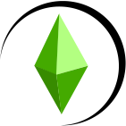

# My Simulation

My Simulation is a life simulation game inspired by The Sims, built using the Godot game engine. I've always been a huge fan of The Sims and always wanted to create my own life simulation game. I decided to use Godot as the game engine and use Kagenashi's behavior tree AI architecture to mimic the one used in The Sims to give the game a similar feel.

## Architecture

### Behavior Trees

For anyone who has modded the old Sims games, you might notice that it uses ``BHAV``, this stands for behavior tree. If you've ever used FreeSO's visual modding tools, you'll notice that it uses a similar pattern. Kagenashi's addon is similar to this but utilizes Godot's component-based pattern.
