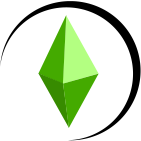

# My Simulation

 
  

My Simulation is a life simulation game inspired by The Sims, built using the Godot game engine. I've always been a huge fan of The Sims and always wanted to create my own life simulation game. I decided to use Godot as the game engine and use Kagenashi's behavior tree AI architecture to mimic the one used in The Sims to give the game a similar feel.

## "Classic Games"

For the sake of simplicity, I'll be referring to Sims 1, 2 and Online as the "classic" games. These all used a virtual machine known as a SimAntics to process behavior trees. Sims 3 and later likely use a different engine. However, it should be noted the term "behaviour tree" itself when in the context of games are functionality decision trees used in modern machine learning models.

## Pages

- [Architecture](./architecture.md)
